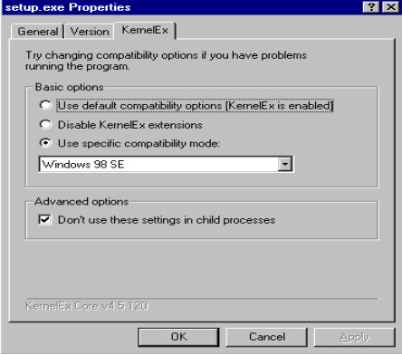

# Interact Box

This is the official Interact Box repository.

Interact Box is a program designed to let people do things to Windows via HTTP requests. It was primarily designed to be used by streamers who wish to use a secondary program to let their chat send commands to a VM.

## What Interact Box does

Interact Box is able to:

- Change wallpapers (location of user-provided wallpapers *must* be specified in application settings, otherwise the default `wallpapers` subdirectory will be used)
- Change every screen's resolution
- Change the color settings
- Spawn message boxes
- Change system sounds
- Change WinAmp skins (if WinAmp is installed)
- Trigger TTS (Windows XP and later *only*)
- Change the boot and shutdown images (Windows 98 and ME *only*)
- Spawn a Windows 3.1 style message box (Windows 98 *only*)
- Run user-provided malware (location *must* be specified in application settings, otherwise the default `malware` subdirectory will be used)
- Delete random files
- Open random files (with the extensions provided in the application settings)
- Play random sound/music files (with the extensions provided in the application settings)
- Reboot the system
- Crash the system
- Spawn message boxes with custom buttons
- Open a trivia game that deletes system-critical files if the wrong answer is picked
- Run terminal commands (COMMAND.COM, cmd.exe, etc)

Functionality is controlled via HTTP requests. Everything here is optional and can be disabled by the user in the application settings.

## A word of caution

This software is **DANGEROUS**!! It lets external applications control your operating system, and as such, should never be run on a non-virtualized environment.

In order to run it on bare metal, you must understand that this software has no warranty, and that you've been explicitly warned against it.

## Supported Windows versions

Currently **supported** targets:

- Windows 98 / 98 SE(*)
- Windows XP
- Windows Vista / 7 (WIP)

Targets which **have not yet been tested, but should be compatible**:

- Windows ME (via Interact Box 98)
- Windows 2000 (via Interact Box 98)
- Windows 8 (via Interact Box Vista)
- Windows 10 (via Interact Box Vista)

My goal is to decrease this list over time. Any feedback on how Interact Box runs on untested versions of Windows is always appreciated!

Windows 95 and older are **incompatible** with Interact Box. Supporting these versions would require a complete rewrite of the HTTP server.

### Important notes about Interact Box 98

#### Requirements

You will need a virtual machine with a simulated Pentium II or later CPU

You will also need to install AutoPatcher for Windows 98, skipping the stability fixes, and KernelEx with Unicows.

Please note that if you include AutoPatcher's stability fixes, Interact Box will not be able to crash the system.

Finally, you'll need Plus! for the themes redeem to work.

#### A note on using KernelEx

You will need to run Interact Box with **Windows XP or 2000 compatibility mode**, as otherwise some related processes, such as the Message Box Process, will refuse to run due to the lack of Unicode support. However, **the installer and uninstaller need to be in Windows 98 SE mode**, otherwise they are unable to kill Interact Box and its related processes before running.

The best way to ensure compatibility is by changing the default mode for KernelEx. To do this, go to C:\WINDOWS\KernelEx and open `Core.ini`. Under `[ApiConfigurations]`, change the value of `default` to 5. It should say `default=5`. Save and reboot.

The start of your `Core.ini` file should look like this:

![Partial screenshot of Core.ini, showing the \[ApiConfigurations\] settings](images/coreini.jpg)

To set KernelEx to Windows 98 SE mode on the installer and uninstaller, right click them, select "Properties", go to the "KernelEx" tab and click the "Use specific compatibility mode" option. This will enable a dropdown menu, where you should select "Windows 98 SE". To make sure Interact Box does not launch in Windows 98 SE mode after installation, tick the "Don't use these settings in child processes" option.

Your properties should look like the image below:



## Supported Linux versions

So far, *only Arch Linux & derivatives* are officially supported.

## Routes

- /
  - Method: GET
  - Returns "pong"

- /baseData
  - Method: GET
  - Returns data from the file utility

- /abort
  - Method: GET
  - Closes Interact Box

- /box
  - Method: POST
  - Body schema:

    ```ts
    {
      "title": string,
      "content": string,
      "type": 'i' | 'q' | 'w' | 'e',
      "buttons": string // up to 3 buttons divided by semicolons (;). Also supports default buttons, as listed below
    }
    ```
  
  - Opens a message box of the specified type, with the specified title, content and buttons. Buttons default to "ok".

- /systemBox
  - Interact Box 98 *only*
  - Method: POST
  - Body schema:

    ```ts
    {
      "text": string
    }
    ```
  
  - Opens a Windows 3.X style box, with the specified text.

- /terminal
  - Method: POST
  - Body schema:

    ```ts
    {
      "command": string,
    }
    ```
  
  - Creates and runs a temporary .bat file with the specified command(s)

- /sound
  - Method: GET  
  - Sets the system sounds to a random audio pack

- /wallpaper
  - Method: GET
  - Sets a random wallpaper

- /deleteRandom
  - Method: GET
  - Deletes a random file

- /openRandom
  - Method: GET
  - Opens a random file

- /music
  - Method: GET
  - Opens a random music file

- /deleteSystem
  - Method: GET
  - Opens a trivia game. If user gets the question wrong or doesn't respond in 10 seconds, the contents of SYSTEM and SYSTEM32 are deleted.

- /runMalware
  - Method: GET
  - Opens a random file in the malware directory. If the file ends in `.inert`, it is renamed before being opened.

- /reboot
  - Method: GET
  - Reboots the system

- /crash
  - Method: GET
  - Crashes the system

- /micro
  - Method: GET
  - Sets a small resolution

- /macro
  - Method: GET
  - Sets a big resolution

- /colors
  - Method: POST
  - Body schema:
  
    ```ts
    {
      "colors": number // 4, 8, 16 or 32
    }
    ```
  
  - Sets the color pallete

- /winamp
  - Method: GET
  - Sets a random WinAmp skin

- /theme
  - Method: GET
  - Sets a random windows theme

- /bootImage
  - Interact Box 98 *only*
  - Method: GET
  - Sets a random image as the splash screen, from those saved in a specific folder

- /tts
  - Interact Box XP and Vista *only*
  - Method: POST
  - Body schema:

    ```ts
    {
      "input": string
    }
    ```
  
  - Has Microsoft Sam read out the contents of the input (will be adapted to accept other TTS voices in the future).

### Default buttons

- 'ok'
- 'ok/cancel' (Alts: 'ok cancel', 'kc', 'oc', 'k/c', 'k c', 'o/c', 'o c', 'o;c', 'k;c', 'ok;cancel')
- 'retry/cancel' (Alts: 'retry cancel', 'rc', 'r/c', 'r c', 'r;c', 'retry;cancel')
- 'abort/retry/ignore' (Alts: 'abort retry ignore' 'ari' 'a/r/i' 'a r i', 'a;r;i', 'abort;retry;ignore')
- 'cancel/try/continue' (Alts: 'cancel try continue', 'ctc', 'c/t/c', 'c t c', 'c;t;c', 'cancel;try;continue')
- 'help' (Alt: 'h')
- 'yes/no' (Alts: 'yes no', 'yn', 'y/n', 'y n', 'y;n', 'yes;no')
- 'yes/no/cancel' (Alts: 'yes no cancel', 'ync', 'y/n/c', 'y n c', 'y;n;c', 'yes;no;cancel')

## Malware, WinAmp skins, music files and wallpapers

Interact Box requires external files in order for the malware, wallpaper, music and WinAmp redeems to function. **It does not accompany any such files.**

In the case of malware and wallpaper files, they must be placed in a specific directory. Interact Box automatically creates both a `malware` and a `wallpapers` subdirectory under its installation directory, where you may place the respective files, but you can also specify a directory using the Interact Box Settings.

**NOTE: It is *highly* recommended that you append `.inert` to the end of malware file names, to prevent the possibility of accidentally running them.** Interact Box will automatically remove `.inert` from the file name before running it.

WinAmp skins and music files may be placed anywhere. By default, Interact Box will only look for .mid and .midi files to play as music, but you may change that in the Interact Box Settings as well. WinAmp skin files must have a .wsz extension.

Naturally, the WinAmp skin redeem requires a Windows 98 compatible version of WinAmp. The recommended version is 2.64.

### Malware with date-specific payloads

Some malware only deploy their payloads in specific dates. You can use the Malware Date Settings tool (`malware_date_settings.exe`) to specify any file name and date combo.

## About the repo's strange design choices

When I originally made this, it was cross-compiled from Arch Linux to Windows 98, specifically. It was a side-project for a friend.

It took me well over a month to get even a hello world to compile that way, although I imagine someone with better CMake and C++ knowledge could've gotten it done way sooner. At the time, this was quite literally my first ever C++ project. Some of the current code is still from that era (sorry).

Not only that, but because I was an idiot back then, it was a monorepo, even with the extras and libraries. Except each edition (98, XP, Vista, etc) was its own separate project with a ton of copy-pasted code, just adapted for each version of Windows. It was also full of global CMake definitions.

In short, it had the exact level of quality you'd expect from a law graduate who taught himself how to code during COVID and was messing with CMake and C++ for the first time ever.

What you see here is my attempt to put *some* order in all that chaos, namely by unifying those loose projects into one singular codebase, and also by breaking up the other executables and libraries into their own submodules.

Given how messy this is, how it's impossible to use Wine to test Windows 98 or XP code, and how some of the functionality is destructive, there is no testing suite at this time. Traditional TDD is unfeasible for this project as-is. That said, a test suite will be developed soon, emphasizing general logic and OS-mocking.

## Contributing

This project is primarily built by **cross-compiling from Linux using MinGW**, and that will remain the case for the foreseeable future. As such:

- All contributions **must be buildable on Linux**
- Windows-only build assumptions should be avoided
- Case-sensitive includes matter (e.g. `windows.h`, not `Windows.h`)

Since this is heavily dependent on MinGW, any contributions that break compatibility with it will be rejected.

That said, contributions that *expand the number of supported compilers* are very welcome! I will, however, have to ensure the compiler can *actually* build this, even if I have to resort to a virtual machine.
